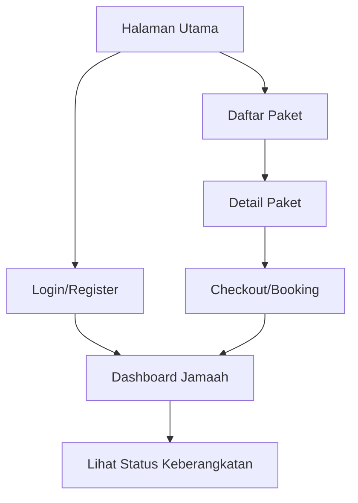

## 1. Product Overview
Website booking Umrah dan Haji yang ditingkatkan dari status prototype menjadi produk produksi yang profesional, minimalis, dan elegan. Website ini menyediakan layanan booking lengkap untuk jamaah yang ingin melaksanakan ibadah Umrah dan Haji dengan pengalaman pengguna yang lancar dan terpercaya.

- Memecahkan masalah tampilan yang tidak terstruktur dan performa yang belum optimal, ditujukan untuk calon jamaah yang mencari paket perjalanan ibadah yang terpercaya.
- Meningkatkan konversi pengguna dan kepuasan pelanggan melalui desain yang modern dan aksesibel.

## 2. Core Features

### 2.1 User Roles
| Role | Registration Method | Core Permissions |
|------|---------------------|------------------|
| Pengguna Umum | Email/Phone registration | Melihat paket, mencari paket, mendaftar menjadi jamaah |
| Jamaah Terdaftar | Verifikasi akun | Memproses booking, membayar paket, melacak status keberangkatan |
| Admin | Invitation only | Mengelola paket, memverifikasi pendaftaran, mengelola pembayaran |

### 2.2 Feature Module
Website memerlukan halaman-halaman utama berikut:
1. **Halaman Utama**: Hero section, paket unggulan, testiminoni jamaah, navigasi utama.
2. **Halaman Daftar Paket**: Filter paket, daftar paket Umrah/Haji, fitur pencarian.
3. **Halaman Detail Paket**: Informasi lengkap paket, jadwal, fasilitas, tombol booking.
4. **Halaman Booking/Checkout**: Formulir data jamaah, ringkasan pesanan, pilihan pembayaran.
5. **Halaman Dashboard Jamaah**: Status booking, riwayat pembayaran, dokumen perjalanan.
6. **Halaman Autentikasi**: Login dan register pengguna.
7. **Halaman Tentang Kami**: Profil penyelenggara, tim, dan kontak.

### 2.3 Page Details
| Page Name | Module Name | Feature description |
|-----------|-------------|---------------------|
| Halaman Utama | Hero section | Tampilkan banner utama dengan CTA "Pesan Sekarang", slide otomatis paket unggulan |
| Halaman Utama | Paket unggulan | Tampilkan 3-4 paket terbaik dengan harga dan rating, navigasi ke halaman detail |
| Halaman Utama | Testimoni | Tampilkan ulasan jamaah sebelumnya dengan foto dan rating bintang |
| Halaman Daftar Paket | Filter & Pencarian | Filter paket berdasarkan jenis (Umrah/Haji), harga, tanggal keberangkatan, dan lokasi |
| Halaman Detail Paket | Informasi paket | Tampilkan detail lengkap: jadwal, fasilitas hotel, transportasi, bimbingan ibadah dan syarat pendaftaran |
| Halaman Detail Paket | Booking CTA | Tombol "Pesan Paket" yang terlihat jelas, menghitung estimasi cicilan jika tersedia |
| Halaman Checkout | Formulir data | Validasi input data jamaah (NIK, paspor, kontak darurat) dengan validasi client-side |
| Halaman Checkout | Pembayaran | Integrasi dengan payment gateway, tampilkan metode pembayaran yang tersedia (transfer, e-wallet, kartu kredit) |
| Halaman Dashboard | Status tracking | Tampilkan progres pendaftaran, status verifikasi dokumen, dan tanggal keberangkatan |
| Halaman Autentikasi | Login/Register | Form login dengan email/telepon, register dengan verifikasi OTP, reset password |
| Semua Halaman | Navigasi Responsive | Navbar yang menyesuaikan layar mobile (hamburger menu), footer dengan link penting |

## 3. Core Process
Alur utama pengguna website:

## 4. User Interface Design
### 4.1 Design Style
- Warna utama: Hijau tua (#166534) sebagai warna utama yang merepresentasikan kesan religius, aksen emas (#D4AF37) untuk elemen premium, latar belakang putih/krem (#F8F7F3)
- Tombol: Rounded-lg dengan shadow subtle, efek hover yang smooth, warna primer hijau untuk CTA utama
- Tipografi: Inter untuk font utama, hierarki jelas (judul 24-32px, subtitle 18-20px, body 14-16px)
- Layout: Grid-based dengan spacing konsisten (8px baseline grid), card-based untuk paket dengan hover effect
- Ikon: Material Icons yang sederhana dan konsisten, tidak berlebihan, dengan animasi subtle saat dihover

### 4.2 Page Design Overview
| Page Name | Module Name | UI Elements |
|-----------|-------------|-------------|
| Halaman Utama | Hero section | Full-width banner dengan overlay gradient, CTA yang menonjol di tengah, text overlay yang jelas |
| Semua Halaman | Navbar | Sticky navbar dengan logo di kiri, menu navigasi, dan tombol login di kanan |
| Daftar Paket | Card Paket | Setiap paket dalam card dengan gambar cover, harga di pojok kanan bawah, rating bintang |
| Dashboard | Sidebar | Sidebar navigasi untuk akses cepat ke halaman profil, pesanan, dokumen |

### 4.3 Responsiveness
Desktop-first design dengan adaptasi penuh ke mobile:
- Breakpoint: 1280px (desktop), 768px (tablet), 360px (mobile)
- Semua elemen menyesuaikan ukuran layar, grid menjadi 1 kolom di mobile, hamburger menu untuk navigasi
- Optimasi touch interaction untuk elemen interaktif di layar sentuh (minimal tap target 48x48px)

### 4.4 Performa dan Aksesibilitas
- Implementasikan kompresi gambar dengan WebP, lazy loading untuk konten di bawah fold
- Kontras warna minimal 4.5:1 untuk text sesuai WCAG 2.1 AA
- Navigasi keyboard yang berfungsi untuk semua elemen interaktif
- Screen reader support dengan label ARIA yang tepat pada semua elemen