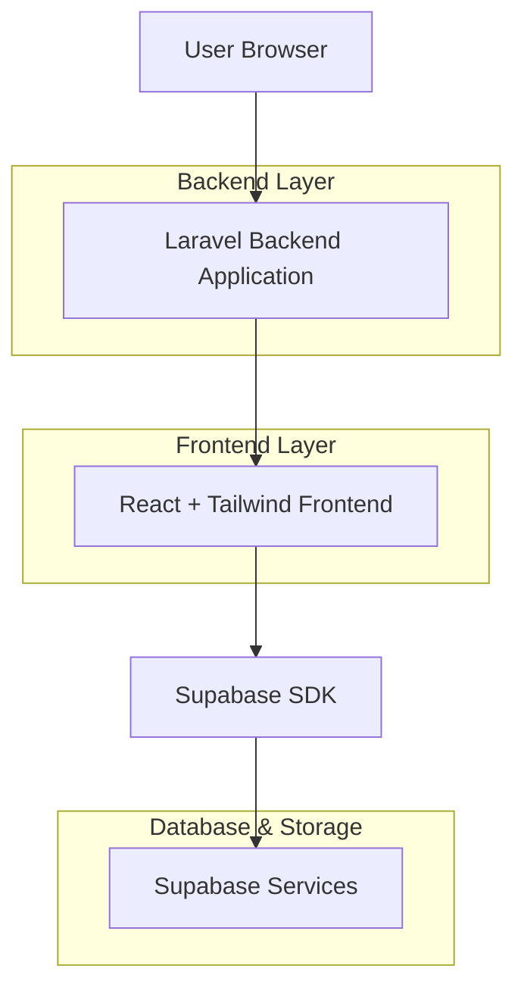
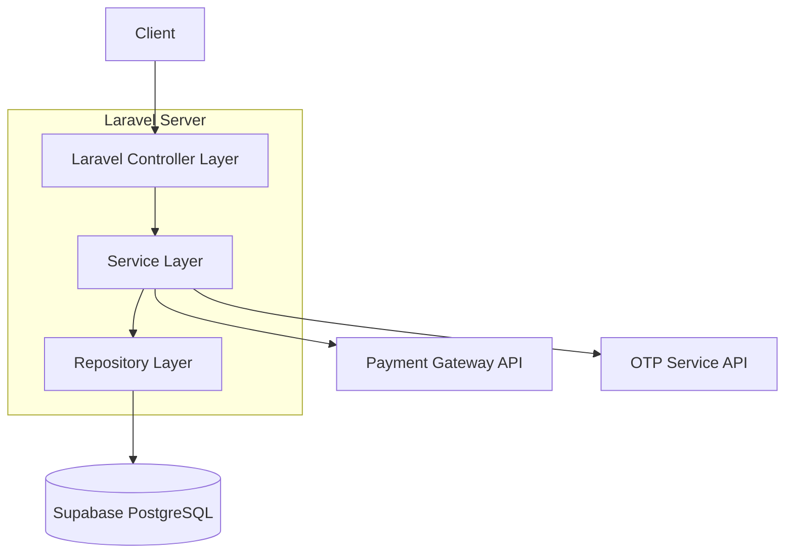

## 1. Architecture Design


## 2. Technology Description
- Frontend: React@18 + TailwindCSS@3 + Vite
- Initialization Tool: vite-init
- Backend: Laravel@11 (PHP 8.3)
- Database: Supabase (PostgreSQL)
- Build Tool: Vite untuk asset compilation dan optimasi

## 3. Route definitions
| Route | Purpose |
|-------|---------|
| / | Halaman utama, menampilkan paket unggulan dan hero section |
| /login | Halaman autentikasi login pengguna |
| /register | Halaman pendaftaran akun baru |
| /packages | Halaman daftar semua paket Umrah dan Haji |
| /packages/{id} | Halaman detail paket spesifik |
| /booking/{id} | Halaman checkout dan proses booking |
| /dashboard | Dashboard utama jamaah terdaftar |
| /dashboard/bookings | Riwayat dan status booking jamaah |
| /dashboard/documents | Manajemen dokumen perjalanan |
| /about | Halaman tentang penyelenggara dan kontak |

## 4. API definitions
### 4.1 Core API Routes (Laravel Backend)
Paket Management
```
GET /api/packages
GET /api/packages/{id}
POST /api/packages/filter
```

Autentikasi
```
POST /api/auth/login
POST /api/auth/register
POST /api/auth/verify-otp
POST /api/auth/reset-password
```

Booking
```
POST /api/bookings/create
GET /api/bookings/{id}
GET /api/user/bookings
PUT /api/bookings/{id}/update
```

### 4.2 Request/Response Example
Login Request
```json
{
  "email": "jamaah@example.com",
  "password": "password123"
}
```

Login Response
```json
{
  "success": true,
  "data": {
    "token": "auth_token_string",
    "user": {
      "id": "uuid-123",
      "name": "Ahmad Jamil",
      "email": "jamaah@example.com",
      "role": "jamaah"
    }
  }
}
```

## 5. Server Architecture Diagram


## 6. Data Model
### 6.1 Data Model Definition
```mermaid
erDiagram
    USERS ||--o{ BOOKINGS : creates
    PACKAGES ||--o{ BOOKINGS : includes
    BOOKINGS ||--o{ PAYMENTS : has
    USERS {
        UUID id PK
        string name
        string email UNIQUE
        string phone
        string password_hash
        string role
        timestamp created_at
    }
    PACKAGES {
        UUID id PK
        string name
        string type "Umrah/Hajj"
        decimal price
        int duration_days
        date departure_date
        text description
        jsonb facilities
        timestamp created_at
    }
    BOOKINGS {
        UUID id PK
        UUID user_id FK
        UUID package_id FK
        string status "pending/confirmed/cancelled"
        jsonb traveler_data
        timestamp booking_date
    }
    PAYMENTS {
        UUID id PK
        UUID booking_id FK
        decimal amount
        string method
        string status "pending/paid/failed"
        timestamp payment_date
    }
```

### 6.2 Data Definition Language (Supabase)
```sql
-- Create users table (extends Supabase auth.users)
CREATE TABLE public.profiles (
    id UUID REFERENCES auth.users PRIMARY KEY,
    full_name VARCHAR(255) NOT NULL,
    phone VARCHAR(20),
    role VARCHAR(20) DEFAULT 'jamaah' CHECK (role IN ('jamaah', 'admin')),
    created_at TIMESTAMP WITH TIME ZONE DEFAULT NOW()
);

-- Create packages table
CREATE TABLE public.packages (
    id UUID PRIMARY KEY DEFAULT gen_random_uuid(),
    name VARCHAR(255) NOT NULL,
    type VARCHAR(20) NOT NULL CHECK (type IN ('umrah', 'hajj')),
    price DECIMAL(12,2) NOT NULL,
    duration_days INTEGER NOT NULL,
    departure_date DATE NOT NULL,
    description TEXT,
    facilities JSONB,
    created_at TIMESTAMP WITH TIME ZONE DEFAULT NOW()
);

-- Create bookings table
CREATE TABLE public.bookings (
    id UUID PRIMARY KEY DEFAULT gen_random_uuid(),
    user_id UUID REFERENCES public.profiles(id) NOT NULL,
    package_id UUID REFERENCES public.packages(id) NOT NULL,
    status VARCHAR(20) DEFAULT 'pending' CHECK (status IN ('pending', 'confirmed', 'cancelled')),
    traveler_data JSONB NOT NULL,
    created_at TIMESTAMP WITH TIME ZONE DEFAULT NOW()
);

-- Create payments table
CREATE TABLE public.payments (
    id UUID PRIMARY KEY DEFAULT gen_random_uuid(),
    booking_id UUID REFERENCES public.bookings(id) NOT NULL,
    amount DECIMAL(12,2) NOT NULL,
    method VARCHAR(50),
    status VARCHAR(20) DEFAULT 'pending' CHECK (status IN ('pending', 'paid', 'failed')),
    payment_date TIMESTAMP WITH TIME ZONE
);

-- Indexes
CREATE INDEX idx_bookings_user_id ON public.bookings(user_id);
CREATE INDEX idx_packages_departure ON public.packages(departure_date);
CREATE INDEX idx_payments_booking_id ON public.payments(booking_id);

-- Enable RLS
ALTER TABLE public.profiles ENABLE ROW LEVEL SECURITY;
ALTER TABLE public.packages ENABLE ROW LEVEL SECURITY;
ALTER TABLE public.bookings ENABLE ROW LEVEL SECURITY;

-- Grant permissions
GRANT SELECT ON public.packages TO anon;
GRANT SELECT ON public.packages TO authenticated;
GRANT ALL ON public.bookings TO authenticated;
GRANT ALL ON public.payments TO authenticated;
```